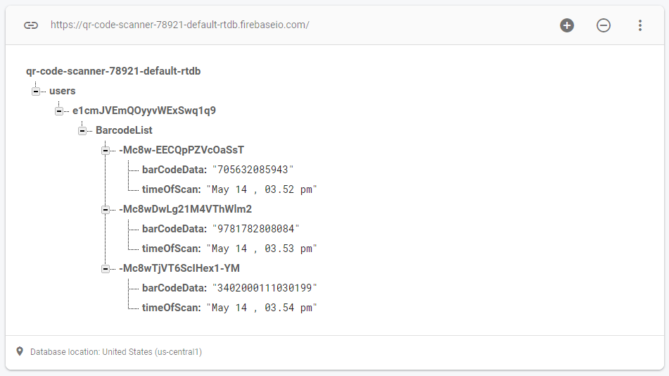
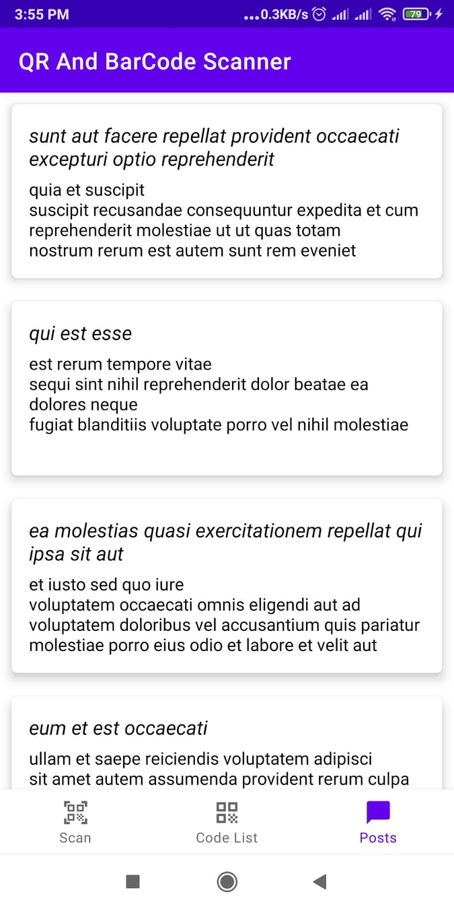
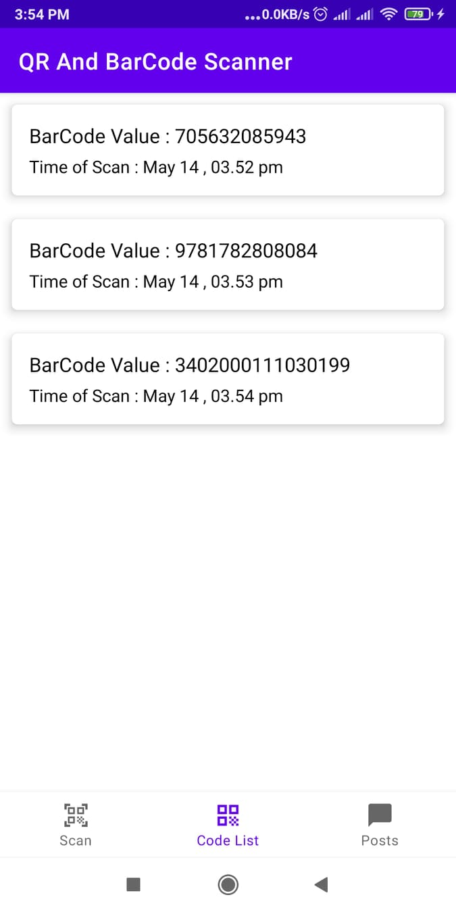
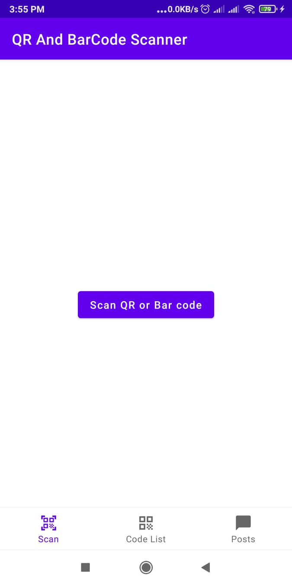

### QR and BarCode Scanner App: 

An android application which allows user to scan qr or barcode and saved it into remote database(Firebase),check the saved Barcode with Scan time , it also gets dummy data from api.

#### Technology Stack:

1. MVVM architecture
2. Navigation Component
3. Data Binding
4. Retrofit 2
5. Firebase Realtime Database

#### ScreenShot of Firebase DB nodes :

#### ScreemShot of App Screen: 

